## Продвинутый SQL

## #1 Работа с типами данных

Мы уже не раз знакомились с типами данных в SQL и написали не один десяток запросов на разнотипных данных. Чем обширнее становятся наши знания, тем в более продвинутые темы мы можем погружаться 🐳. Если раньше нашей задачей было быстро пробежаться по верхам SQL, чтобы сложить общую картину и быть способным написать базовые запросы, то теперь мы будем пытаться охватить материал более полно.
В рамках ближайших нескольких уроков мы рассмотрим особенности типов данных, при работе с которыми часто возникают проблемы и ошибки. А с помощью практических заданий сразу же отработаем наиболее трудные моменты, чтобы в дальнейшем они не вызывали проблем при составлении запросов.

### #1.1 Числовой тип данных в SQL

Создание числовых данных в SQL достаточно простое: можно ввести число как литерал, можно получить его из столбца таблицы или сгенерировать его путём вычислений.
При вычислениях можно использовать все стандартные арифметические операции (+, -, *, / и прочие) и изменять приоритеты вычислений с помощью скобок.

    SELECT 2 * ((22 - 16) / (2 + 1)) AS calc_example;
    
    calc_example
    4

**Математические функции**

Для большинства математических вычислений, таких как получение степени числа или получение квадратного корня, в SQL есть встроенные числовые функции. Вот некоторые примеры данных функций:

| Имя функции | Описание |
| ------------- | ------------- |
| POW(num, power) | Вычисляет число в указанной степени|
| SQRT(num) | Вычисляет квадратный корень числа |
| LOG(base, num) | Вычисляет логарифм числа по указанному основанию |
| EXP(num) | Вычисляет enum |
| SIN(num) | Вычисляет синус числа |
| COS(num) | Вычисляет косинус числа |
| TAN(num) | Вычисляет тангенс числа |

Список всех числовых функций, их описание и примеры можно посмотреть в справочнике.

**Округление чисел**

При работе с числами с плавающей точкой не всегда требуется сохранение или отображение чисел с полной точностью. Так, денежные транзакции можно хранить с точностью до 6 знаков после запятой, а отображать до 2, с точностью до копеек.

Для округления числовых данных в SQL предусмотрены следующие 4 функции: *CEIL, FLOOR, ROUND, TRUNCATE*.

Функции *CEIL, FLOOR* направлены на то, чтобы округлять число к ближайшему целому числу в большую и в меньшую сторону соответственно.

    SELECT CEILING(69.69) AS ceiling, FLOOR(69.69) AS floor;
    
| ceiling | floor |
| ------------- | ------------- |
| 70 | 69 |

Для округления к ближайшему целому числу есть функция *ROUND*, которая любое число, десятичная часть которого больше или равна 0.5, округляет в большую сторону, иначе в меньшую.

    SELECT ROUND(69.499), ROUND(69.5), ROUND(69.501);

| ROUND(69.499) | ROUND(69.5) | ROUND(69.501) |
| ------------- | ------------- | ------------- |
| 69 | 70 | 70 |

Функция *ROUND* также позволяет округлять число до некоторой части десятичных знаков после запятой. Для этого функция принимает второй необязательный аргумент с указанием количества знаков после запятой, которые требуется оставить.

    SELECT ROUND(69.7171,1), ROUND(69.7171,2), ROUND(69.7171,3);

| ROUND(69.7171,1) | ROUND(69.7171,2) | ROUND(69.7171,3) |
| ------------- | ------------- | ------------- |
| 69.7 | 69.72 | 69.717 |

Второй аргумент функции *ROUND* может принимать также и отрицательные значения. В этом случае, цифры слева от десятичной точки числа становятся равными нулю на указанное в аргументе количество, а дробная часть обрезается.

    SELECT ROUND(1691.7,-1), ROUND(1691.7,-2), ROUND(1691.7,-3);

| ROUND(1691.7,-1) | ROUND(1691.7,-2) | ROUND(1691.7,-3) |
| ------------- | ------------- | ------------- |
| 1690 | 1700 | 2000 |

Функция *TRUNCATE* аналогична функции *ROUND*, она также способна принимать 2-й необязательный параметр, только вместо округления она просто отбрасывает ненужные цифры.

    SELECT TRUNCATE(69.7979,1), TRUNCATE(69.7979,2), TRUNCATE(69.7979,3);

| TRUNCATE(69.7979,1) | TRUNCATE(69.7979,2) | TRUNCATE(69.7979,3) |
| ------------- | ------------- | ------------- |
| 69.7 | 69.79 | 69.797 |

**Работа со знаковыми числами**

При работе с числовыми данными, в которых возможно наличие отрицательных значений, могут быть полезными функции *SIGN* и *ABS*.
Функция *SIGN* возвращает значение -1, если число отрицательно, 0, если число нулевое и 1, если число положительное.

    SELECT SIGN(-69), SIGN(0), SIGN(69);

| SIGN(-69) | SIGN(0) | SIGN(69) |
| ------------- | ------------- | ------------- |
| -1 | 0 | 1 |

Функция *ABS* возвращает абсолютное значение числа.

    SELECT ABS(-69), ABS(0), ABS(69);

| ABS(-69) | ABS(0) | ABS(69) |
| ------------- | ------------- | ------------- |
| 69 | 0 | 69 |

### #1.2 Дата и время в SQL

Из всех типов данных в SQL временны́е данные являются наиболее сложными 🤯. Сложность возникает по нескольким причинам, и вот некоторые из них:
* множество способов задания даты и времени
* наличие временных зон
* неочевидность вычислений некоторых значений на основании временных данных. Например, сложность вычисления возраста.

**Генерация временных данных**

Временные данные можно получить одним из следующих способов:
* скопировать данные из существующего столбца с времéнным типом данных
* задать дату и время через строковое представление получить временны́е данные путём вызова встроенных функций, возвращающих временной тип данных

**Строковое представление временных данных**

Для задания даты и времени используются следующие форматы:

| Тип | Формат по умолчанию |
| ------------- | ------------- |
| DATE | YYYY-MM-DD |
| DATETIME | YYYY-MM-DD hh:mm:ss |
| TIMESTAMP | YYYY-MM-DD hh:mm:ss |
| TIME | hhh:mm:sss| 
| YEAR | YYYY - полный формат |

*YY* или *Y* - сокращённый формат, который возвращает год в пределах 2000-2069 для значений 0-69 и год в пределах 1970-1999 для значений 70-99
Причём, при указании даты допускается использовать любой знак пунктуации в качестве разделительного между частями разделов даты или времени. Также возможно задавать дату вообще без разделительного знака, слитно.

Примеры валидного задания временных значений через строковое представление:

    SELECT  CAST("2022-06-16 16:37:23" AS DATETIME) AS datetime_1,
            CAST("2014/02/22 16*37*22" AS DATETIME) AS datetime_2,
            CAST("20220616163723" AS DATETIME) AS datetime_3,
            CAST("2021-02-12" AS DATE) AS date_1,
            CAST("160:23:13" AS TIME) AS time_1,
            CAST("89" AS YEAR) AS year

| datetime_1 | datetime_2 | datetime_3 | date_1 | time_1 | year |
| ------------- | ------------- | ------------- | ------------- | ------------- | ------------- |
| 2022-06-16T16:37:23.000Z | 2014-02-22T16:37:22.000Z | 2022-06-16T16:37:23.000Z | 2021-02-12T00:00:00.000Z | 160:23:13 | 1989 |

В запросе выше для принудительного преобразования строки в дату и время была использована функция *CAST*. Она необходима, если сервер не ожидает временного значения и, соответственно, автоматически не преобразует строку к нужному типу. С преобразованием типов мы более подробно познакомимся в статье «Функции преобразования типов, CAST».

**Функции генерации дат**

Если необходимо получить временные данные из строки, которая не соответствует ни одному формату, который принимает функция *CAST*, то можно использовать встроенную функцию *STR_TO_DATE*, которая принимает произвольную строку, содержащую дату, и формат, описывающий её.

    SELECT STR_TO_DATE('November 13, 1998', '%M %d, %Y') AS date;
    
    date
    1998-11-13T00:00:00.000Z

Более подробное описание функции *STR_TO_DATE* и её аргументов можно посмотреть в справочнике.

Для генерации же текущей даты или времени нет необходимости создавать строку для последующего её преобразования в дату, потому что есть встроенные функции для получения данных значений: *CURDATE, CURTIME и NOW*.

    SELECT CURDATE(), CURTIME(), NOW();

**Функции извлечения временных данных**

Иногда необходимо получить не всю дату, а только её конкретную часть, например, месяц или год.
Для этого в SQL есть следующие функции:

| Функция | Описание |
| ------------- | ------------- |
| YEAR | Возвращает год для указанной даты |
| MONTH | Возвращает числовое значение месяца года (от 1 до 12) даты |
| DAY | Возвращает порядковый номер дня в месяце (от 1 до 31) |
| HOUR | Возвращает значение часа (от 0 до 23) для времени |
| MINUTE | Возвращает значение минут (от 0 до 59) для времени |

**Отличие DATETIME от TIMESTAMP**

В MySQL есть очень похожие друг на друга типы данных: *DATETIME и TIMESTAMP*. Они оба направлены на хранение даты и времени, но имеют ряд отличий, определяющих их целевое использование.

<table>
    <tr>
        <td>Критерий</td>
        <td>DATETIME</td>
        <td>TIMESTAMP</td>
    </tr>
    <tr>
        <td>Диапазон</td>
        <td>
        от 1000-01-01  00:00:00 
        до 9999-12-31 23:59:59 
        </td>
        <td>
        от 1970-01-01 00:00:00 
        до 2038-01-19 03:14:07 
        </td>
    </tr>
    <tr>
        <td>Часовой пояс</td>
        <td>
        Не учитывается 
        Отображается в таком виде, в котором дата была установлена 
        </td>
        <td>
        Учитывается 
        При выборках отображается с учётом текущего часового пояса сервера БД 
        </td>
    </tr>
</table>

**Часовые пояса**

Так как люди во всем мире хотят, чтобы полдень примерно соответствовал максимальному подъёму Солнца, то никогда не было задачи использовать универсальное время и мир был разделён на 24 часовых пояса.

В качестве точки отсчёта времени используется *UTC (Coordinated Universal Time)*. Все остальные часовые пояса можно описать количеством часов сдвига от UTC. Для примера, часовой пояс Москвы может быть описан как UTC+3.

Часовой пояс является одной из настроек сервера баз данных и может задаваться:
* глобально
* для текущего пользователя
* для текущей пользовательской сессии

    SET GLOBAL time_zone = '+03:00';    // глобально
    SET time_zone = '+03:00';           // для текущего пользователя
    SET @@session.time_zone = '+03:00'; // для текущей пользовательской сессии

Соответственно, при изменении временной зоны все значения с типом *TIMESTAMP* будут выводиться с учётом текущей активной временной зоны.

**Примеры задач на дату и время**

Хочется отдельно остановиться на наиболее популярных задачах, связанных с временным типом данных, на которых часто совершаются ошибки.

*Определение возраста*

При постановке задачи найти возраст человека по дате его рождения часто возникает соблазн 😈 вычислить разницу текущего года и года рождения человека:

    SELECT YEAR(NOW()) - YEAR('2003-07-03 14:10:26');

Проблема такого подхода в том, что он не учитывает был ли день рождения у данного человека в этом году или ещё нет. То есть, если на момент запроса уже наступило 3-е июля (07-03), то человек отпраздновал свой день рождения и ему уже 20 лет, иначе ему по-прежнему 19 года. Разница функций YEAR тут будет бесполезна — в обоих случаях она даст 20 лет.

Если определить возраст через разницу годов — неработающий вариант, то может возникнуть желание найти возраст через разницу дней между двумя датами, затем поделить эту разницу на количество дней в году и округлить вниз:

    SELECT FLOOR(DATEDIFF(NOW(), '2003-07-03 14:10:26') / 365);

И это решение будет гораздо точнее предыдущего. Но оно не будет абсолютно точным из-за наличия високосных годов, когда в году 366 дней. Хотя погрешность в вычислении возраста для 1 человека из-за наличия високосного года достаточно низкая, в вычислениях на определение, скажем, среднего возраста среди определённого списка людей, погрешность может накапливаться и исказить реальные значения.

И как же тогда корректно определять возраст? Для этого есть готовая встроенная функция — *TIMESTAMPDIFF*, которая первым аргументом принимает единицу измерения, в которой нужно вернуть разницу между двумя временными значениями.

    SELECT TIMESTAMPDIFF(YEAR, '2003-07-03 14:10:26', NOW());

## #2 Функции преобразования типов, CAST

Когда мы выполняем операции со значениями с разными типами данных, СУБД пытается выполнить преобразование и привести используемые значения к нужному типу. Например, в примере ниже мы сравниваем значения с типами STRING и INT. Чтобы выполнить это сравнение MySQL автоматически сконвертирует строковое значение в числовое.

    SELECT '50' > 49, '50' > 51;

    '50' > 49   |   '50' > 51
    1           |    0

Но не все преобразования СУБД может сделать автоматически, и тогда необходимо делать явное преобразование типов. Для этого в MySQL есть две очень схожие функции CAST и CONVERT.

Синтаксис

    CAST(значение AS тип_для_конвертации);
    CONVERT(значение, тип_для_конвертации);

    SELECT CAST(12005.6 AS DECIMAL), CONVERT(12005.4, DECIMAL);

    CAST(12005.6 AS DECIMAL)    |    CONVERT(12005.4, DECIMAL)
    12006                       |	12005

Функция CAST умеет конвертировать переданное значение в любой из следующих типов:

<table>
    <tr>
        <td>Тип</td>
        <td>Описание</td>
    </tr>
    <tr>
        <td>DATE</td>
        <td>
        Конвертирует значение в DATE 
        Формат: "YYYY-MM-DD" 
        </td>        
    </tr>
    <tr>
        <td>DATETIME</td>
        <td>
        Конвертирует значение в DATETIME 
        Формат: "YYYY-MM-DD hh:mm:ss" 
        </td>
    </tr>
        <tr>
        <td>TIME</td>
        <td>
        Конвертирует значение в TIME 
        Формат: "hh:mm:ss" 
        </td>   
    <tr>
        <td>DECIMAL[(M[,D])]</td>
        <td>
        Конвертирует значение в DECIMAL.
        Имеет два необязательных аргумента M и D, 
        определяющих максимальное количество знаков до и после запятой соответственно. 
        По умолчанию, D равен 0, а M равен 10. 
        </td>
    </tr>
    <tr>
        <td>CHAR[(N)]</td>
        <td>
        Конвертирует значение в CHAR. 
        В качестве необязательного аргумента можно передать максимальную длину строки 
        </td>
    </tr>
        <tr>
        <td>SIGNED</td>
        <td>
        Конвертирует значение в значение BIGINT
        </td>
    </tr>
    <tr>
        <td>UNSIGNED</td>
        <td>
        Конвертирует значение в беззнаковое значение BIGINT
        </td>
    </tr>
    <tr>
        <td>BINARY</td>
        <td>
        Конвертирует значение в BINARY
        </td>
    </tr>
    <tr>
        <td>YEAR</td>
        <td>
        Конвертирует значение в год
        </td>
    </tr>
</table>

**Невозможность любой конвертации**

Использование функции CAST накладывает требования к формату исходного значения. И сразу же напрашивается вопрос, что произойдёт, если данный формат не будет соответствовать необходимому? Например, если попробовать сконвертировать случайный текст во временной тип данных:

    SELECT CAST('SQL Academy' AS DATETIME);

    CAST('SQL Academy' AS DATETIME)
    <NULL>

В этом  случае MySQL вернёт NULL вместо сконвертированного значения.

## #3 Оконные функции SQL

Оконные функции — мощный инструмент языка SQL, позволяющий проводить сложные вычисления по группам строк, которые связаны с текущей строкой.

**Прнципы работы**

Возможно, вы зададитесь вопросом: «Что значит оконные?».

В стандартном SQL-запросе все наборы строк рассматриваются как один сплошной блок данных, для которого и вычисляются агрегатные значения.
Однако, когда применяются оконные функции, запрос сегментируется на группы строк (или «окна»), и для каждого такого сегмента подсчитываются индивидуальные агрегатные значения.

Это окно, которое подаётся в оконную функцию, может быть:
•	всей таблицей
•	отдельными партициями таблицы, то есть группой строк на основе одного или нескольких полей
•	или даже конкретным диапазоном строк в пределах таблицы или партиции. Например, мы можем определить окно, которое будет передаваться в оконную функцию, как предыдущая + текущая строка таблицы. И тогда для каждой строки значение агрегатной функции будет подсчитываться по-своему, так как данные, которые поступают в функцию будут динамически меняться от строке к строке. Окно будет как бы «скользить» по таблице.

**Визуализация**

Оконные функции всегда принимают на вход окно данных, которое указывает пользователь, и возвращают результат в отдельный столбец.

Давайте рассмотрим как это может выглядеть. Для этого возьмём оконную функцию AVG для вычисления среднего значения и вот такую небольшую таблицу

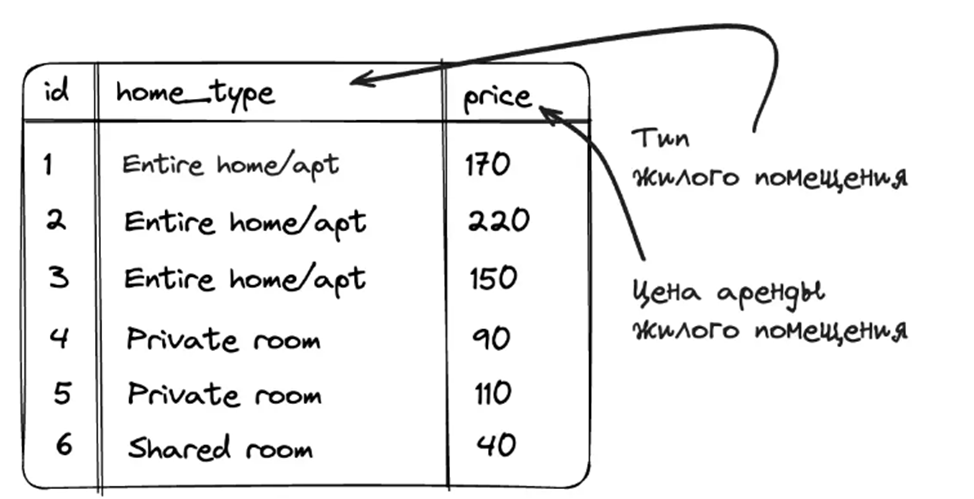

А теперь давайте посмотрим как оконная функция будет работать для разных переданных окон:
- если в качестве окна указать всю таблицу, то для всех строк окно будет совпадать и на вход функции AVG будет поступать один и тот же набор данных, и, соответственно, результат будет одинаковый;

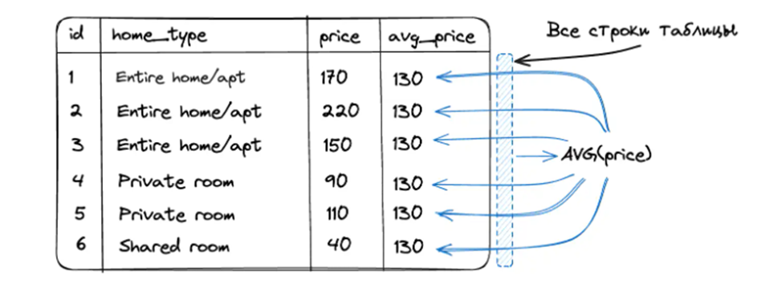

- если в качестве окна указать партицию по полю home_type, то на вход функции AVG будет поступать набор жилых помещений с одинаковым типом, и, соответственно, в результате в новой колонке будет отображаться средняя стоимость по жилью, чей тип совпадает с типом у текущей строки таблицы.

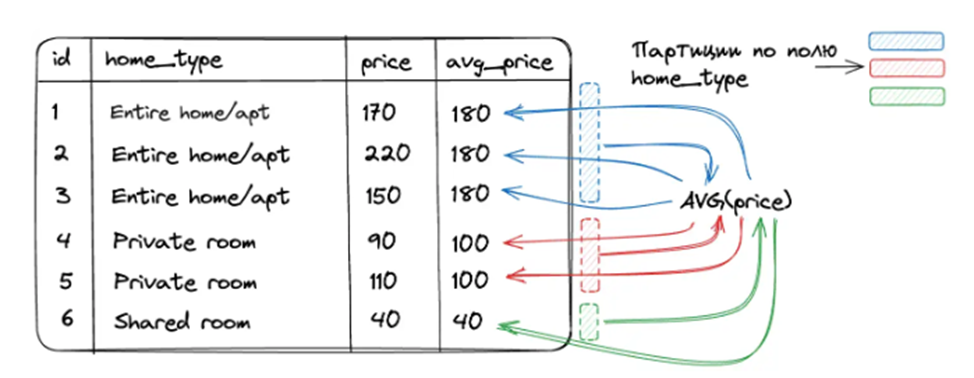

В качестве окна можно указать и более специфический набор строк. Например, окно можно определить как "предыдущая + текущая строка" таблицы. Тогда это будет выглядеть следующим образом:

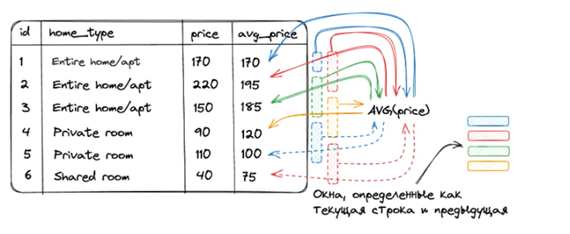

Стоит отметить, что для первой строки окно будет состоять только из 1-ой записи, так как предыдущей строки нет.

**Синтаксис оконной функции**

    SELECT <оконная_функция>(<поле_таблицы>)
    OVER (
      [PARTITION BY <столбцы_для_разделения>]
      [ORDER BY <столбцы_для_сортировки>]
      [ROWS|RANGE <определение_диапазона_строк>]
    )

Где:
<оконная_функция>(<поле_таблицы>) — используемая оконная функция. 
Например AVG(price).
Далее следует OVER, который определяет окно (группу строк), которое будет передаваться в оконную функцию. Если конструкцию OVER () оставить без параметров, то окном будет выступать вся таблица.

Далее внутри OVER следуют 3 необязательных параметра, с помощью которых можно гибко настраивать окно:
•	с помощью PARTITION BY <столбцы_для_разделения> выборка делится на непересекающиеся подмножества, где каждое подмножество содержит строки с одинаковыми значениями в одном или нескольких столбцах, образуются партиции.
•	с помощью ORDER BY <столбцы_для_сортировки> устанавливается порядок строк внутри окна, особо важную роль играет в оконных функциях ранжирования.
•	с помощью ROWS|RANGE <определение_диапазона_строк> формируются диапазоны строк. С помощью этого параметра можно указать сколько строк брать до и после текущей в окно.

**Пример использования оконной функции**

Для начала получим список студентов и идентификатор класса, в котором они учатся:

    SELECT
        Student.first_name,
        Student.last_name,
        Student_in_class.class
    FROM
        Student_in_class
    JOIN
        Student ON Student_in_class.student = Student.id;

| first_name | last_name | class | 
| ------------- | ------------- | ------------- |
| Nikolaj | Sokolov | 9 |
| Vyacheslav | Eliseev | 9 |
| Ivan | Efremov | 9 |
| Anatolij | Zhdanov | 9 |
| Georgij | Noskov | 9 |
| Artyom | Sergeev | 9 |
| . | . | . |
| Egor | Belyakov | 1 |

А теперь, чтобы вычислить сколько учащихся учится в каждом из классов и вывести эту информацию в новую колонку, мы можем применить оконную функцию:

    SELECT
        Student.first_name,
        Student.last_name,
        Student_in_class.class,
        COUNT(*) OVER (PARTITION BY Student_in_class.class) AS student_count_in_class
    FROM
        Student_in_class
    JOIN
        Student ON Student_in_class.student = Student.id;

| first_name | last_name | class | student_count_in_class |
| ------------- | ------------- | ------------- | ------------- |
| Egor | Belyakov | 1 | 7 |
| Artyom | Nikitin | 1 | 7 |
| Innokentij | Nekrasov | 1 | 7 |
| Semyon | Voronov | 1 | 7 |
| Angelina | Lazareva | 1 | 7 |
| Margarita | Kabanova | 1 | 7 |
| . | . | . | . |
| Nikolaj | Sokolov | 9 | 13 |

**Что делает наша оконная функция**

Выражение PARTITION BY Student_in_class.class разделяет все строки таблицы на партиции по полю class. Так, для каждой из строк в оконную функцию будут подаваться только те строки таблицы, где поле class совпадает с полем class в текущей строке.
Функция COUNT же возвращает количество переданных в неё строк, тем самым мы и получаем сколько учащихся учится в каждом из классов.

**Порядок выполнения оконных функций в SELECT**

При использовании оконных функций важно понимать в какой последовательности они будут исполняться. Так, как мы можем увидеть на схеме ниже, окна отрабатывают предпоследним шагом, уже после фильтрации и группировки, но перед финальной сортировкой результатов выборки.

### #3.1 Партиции оконных функций

**Понятие партиции**

Партиции — подмножества строк, выделенные для оконной функции на основе одного или нескольких столбцов в таблице.

Они служат для сегментации данных, позволяя выполнить более детальный анализ и расчёты вроде агрегации или ранжирования внутри каждой такой группы.

Применяя партиционирование, например, по типу жилья в таблице с данными о цене жилья, мы можем рассчитать в отдельной колонке, скажем, среднюю цену для каждого типа жилья.

**Применение партиций в SQL**

Для того, чтобы использовать партицию вместе с оконной функцией необходимо придерживаться следующего синтаксиса:

    SELECT <оконная_функция>(<поле_таблицы>)
    OVER (
        PARTITION BY <столбцы_для_разделения>
    )

**Пример использования**

Рассмотрим использование партиции вместе с оконной функцией.

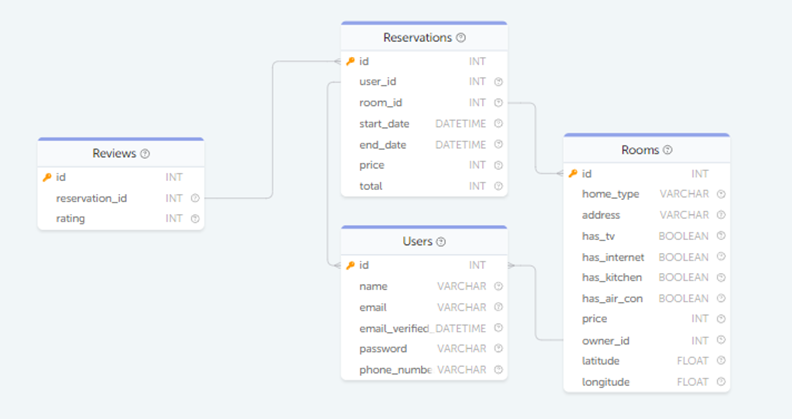

Для этого рассмотрим таблицу Rooms, а именно поля home_type и price:

    SELECT home_type, price FROM Rooms;

| home_type | price | 
| ------------- | ------------- |
| Private room | 149 |
| Entire home/apt | 225 |
| Private room | 150 |
| Entire home/apt | 89 |
| Entire home/apt | 80 |
| Entire home/apt | 200 |

Мы можем увидеть, что все жильё для аренды разделено на 3 категории: «Private room», «Entire home/apt» и «Shared room».
Каждая категория жилья имеет свои ценовые рамки. Чтобы узнать среднюю стоимость в конкретной категории и сравнить её с текущей, как раз можно использовать оконные функции.

Для этого добавим к нашей результирующей таблице ещё одно поле avg_price, которое будет высчитывать среднюю цену по категориям. Это будет выглядеть следующим образом:

    SELECT
        home_type, price,
        AVG(price) OVER (PARTITION BY home_type) AS avg_price
    FROM Rooms;

| home_type | price | avg_price |
| ------------- | ------------- | ------------- |
| Entire home/apt | 225 | 148.6667 |
| Entire home/apt | 180 | 148.6667 |
| Entire home/apt | 150 | 148.6667 |
| . | . | . |
| Private room | 130 | 89.4286 |
| Private room | 120 | 89.4286 |
| . | . | . |
| Shared room | 40 | 40 |

Что именно происходит в добавленной строке?

•	PARTITION BY home_type делит все записи на разные партиции на основе уникальных значений столбца home_type;
•	затем, для каждой записи, AVG(price) вычисляет среднюю цену (price) в рамках её партиции (home_type), результатом выполнения этой части запроса будет столбец avg_price, в котором для каждой записи будет указано среднее значение цены для её категории жилья (home_type).

**Партиция по нескольким колонкам**

Партиционирование также может быть выполнено по нескольким колонкам. Это позволяет создавать более сложные и точные сегменты для анализа.

Например, для нашей таблицы Rooms мы можем создать партиции на основании 2 колонок: категория жилья home_type и наличие телевизора в жилье has_tv.

Пример запроса с партиционированием по двум столбцам:

    SELECT
        home_type, has_tv, price,
        AVG(price) OVER (PARTITION BY home_type, has_tv) AS avg_price
    FROM Rooms;

| home_type | price | avg_price | avg_price |
| ------------- | ------------- | ------------- | ------------- |
| Entire home/apt | 0 | 225 | 170 |
| Entire home/apt | 0 | 180 | 170 |
| . | . | . | . |
| Entire home/apt | 0 | 190 | 170 |
| Entire home/apt | 0 | 215 | 170 |
| . | . | . | . |
| Entire home/apt | 1 | 85 | 132.6667 |
| Entire home/apt | 1 | 150 | 132.6667 |

Здесь PARTITION BY home_type, has_tv создаёт уникальные партиции для каждой комбинации home_type и has_tv, позволяя вычислить среднюю цену жилья для текущей категории жилья с наличием или без наличия телевизора.

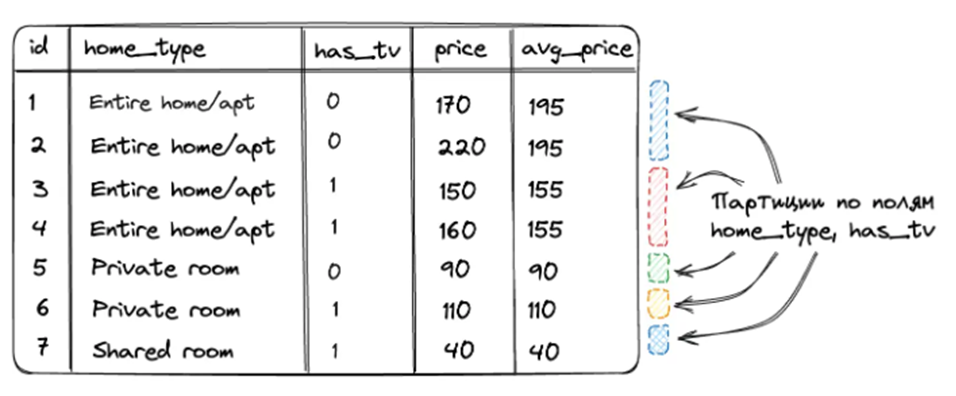

### #3.2 Сортировка внутри окна

**Зачем нужна сортировка внутри окна**

Сортировка в оконных функциях SQL — ключ к расширенному анализу данных. Она позволяет упорядочивать данные внутри определённой группы или окна, обеспечивая более точные и нацеленные агрегатные вычисления. Это особенно полезно при работе с временными рядами, где важен порядок событий, или при ранжировании данных внутри групп.

**Пример использования**

*Постановка задачи*

Предположим, нам нужно проанализировать данные о бронированиях жилых помещений, чтобы выяснить, как менялась общая сумма затраченных средств на аренду для каждого пользователя со временем.
Изначально мы имеем следующую выборку о бронированиях:

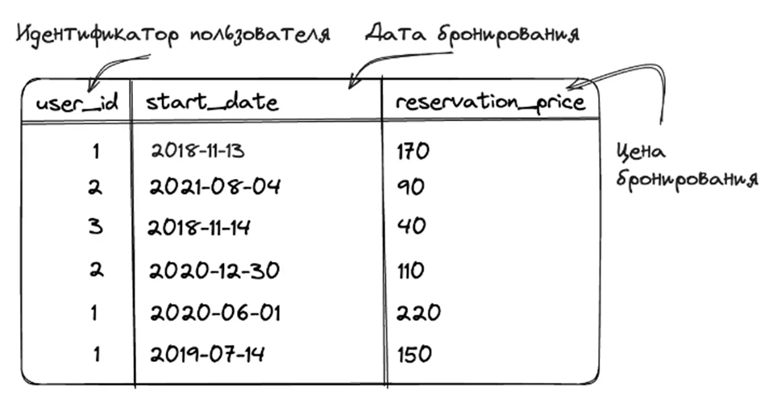

А как результат мы хотим увидеть изменение затраченных средств по каждому пользователю со временем, то есть таблицу следующего вида:

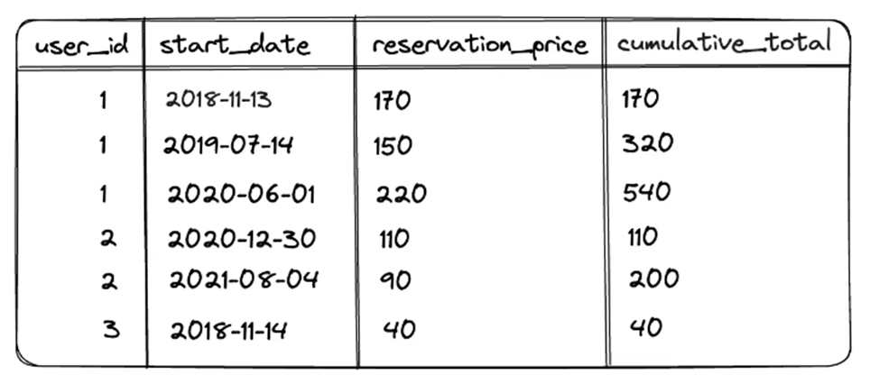

*Разделение данных на партиции*

Чтобы получить необходимый результат, в первую очередь, мы должны разбить данные на партиции по каждому пользователю, чтоб оконная функция работала для каждого пользователя независимо. Для получения же суммы мы можем использовать оконную функцию SUM.

    SELECT user_id,
        start_date,
        total AS reservation_price,
        SUM(total) OVER (
                PARTITION BY user_id
        ) AS total_expenses
    FROM Reservations;

В результате выполненного запроса в колонке total_expenses вывелась общая сумма затраченных средств с разбивкой по пользователям. Но это не совсем то, что мы хотим: данные в таблице не упорядочены по дате и мы не видим как общие расходы росли со временем, мы видим только финальные расходы.

Чтобы получить желаемый результат, нам как раз понадобится добавить в запрос сортировку по дате начала бронирования:

    SELECT user_id,
        start_date,
        total AS reservation_price,
        SUM(total) OVER (
            PARTITION BY user_id
            ORDER BY start_date
        ) AS cumulative_total
    FROM Reservations;

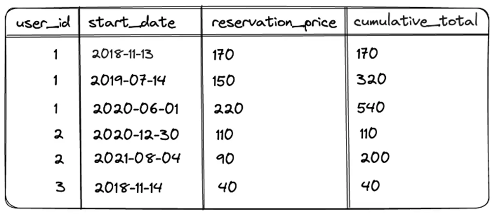

Теперь мы получили то, что и хотели. Но что изменилось после добавления ORDER BY start_date?

1.	Данные в рамках партиции стали отсортированы по дате начала бронирования.
2.	Изменился способ подсчёта общей суммы затраченных средств: теперь сумма в рамках партиции накапливается, а не выводится как финальная. Это связано с одной особенностью использования сортировки без явного указания ROWS|RANGE в выражении OVER. На этом остановимся поподробнее.

Особенности использования сортировки без указания рамок окна

Как мы помним полный синтаксис оконной функции выглядит следующим образом:

    SELECT <оконная_функция>(<поле_таблицы>)
    OVER (
        [PARTITION BY <столбцы_для_разделения>]
        [ORDER BY <столбцы_для_сортировки>]
        [ROWS|RANGE <определение_диапазона_строк>]
    )

Помимо блока с PARTITION BY и ORDER BY в нем присутствует опциональный блок ROWS|RANGE, на нем мы остановимся детально далее, но сейчас важнее, то для чего он нужен. Он позволяет указать рамки окна относительно текущей строки, которые будут использоваться для вычисления в оконной функции.
Так, можно указать, чтобы при рассчитывании значений для текущей строки в оконную функцию отправились не все записи в рамках текущей партиции, а только N записей до текущей строки и N после.
При использовании ORDER BY, если в блоке ROWS|RANGE ничего не указано, то в оконной функции автоматически применяется правило RANGE BETWEEN UNBOUNDED PRECEDING AND CURRENT ROW. Это означает, что окно будет начинаться с первой строки и заканчиваться текущей строкой.
То есть значения для колонки cumulative_total будут высчитываться следующим образом:

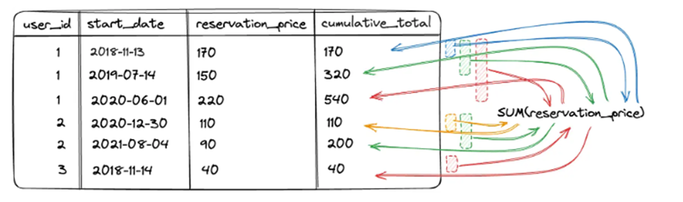

### #3.3 Рамки окон

В контексте оконных функций SQL, «окно» определяет подмножество строк, которые рассматриваются SQL-функцией при выполнении вычислений.

Другими словами, окно — это динамический набор строк, который "скользит" по вашему результату запроса, образуя различные наборы данных для каждой строки, в зависимости от заданного вами определения окна.

**Окно VS Партиция**

Хотя термины "окно" и "партиция" могут показаться схожими, они представляют разные концепции:

Партиция (PARTITION BY) - это деление всего набора результатов на непересекающиеся подмножества, 
где каждое подмножество содержит строки с одинаковыми значениями в одном или нескольких столбцах. 
Оконные функции применяются отдельно к каждой партиции, как если бы каждая из них была отдельным 
набором данных.

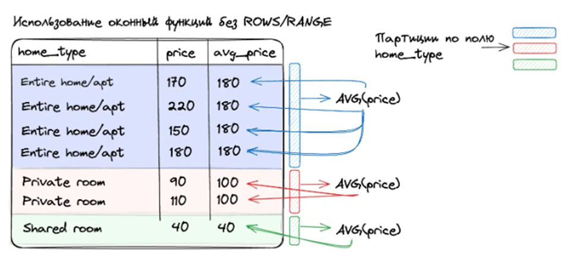

Окно - Определяет, какие конкретные строки в каждой партиции будут использоваться для вычисления оконной функции для каждой строки. Окно может изменяться от строки к строке.

Например, если используется правило ROWS BETWEEN 1 PRECEDING AND CURRENT ROW, то для каждой строки окно будет состоять из неё самой и одной предшествующей строки. Это как "подпартиция" внутри уже существующей партиции.

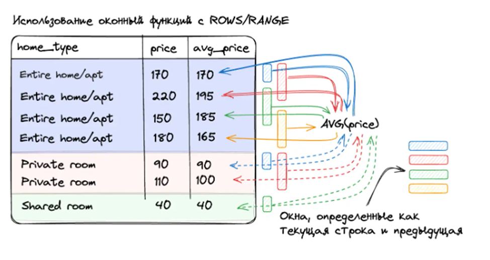

То есть:

•	Первое окно у нас состоит только из 1-ой записи, потому что предыдущей записи нет. Одна единственная запись подаётся в агрегатную функцию AVG(price) и результат добавляется в поле avg_price;
•	Второе окно у нас уже содержит 1 и 2 запись, которые и отправляются в AVG(price) и возвращают (170 + 220) / 2 = 195;
•	Третье окно у нас содержит 2 и 3 запись, результат (220 + 150) / 2 = 185;
•	и т.д.

*Примечание об окне без ROWS/RANGE*

Если в определении оконной функции отсутствует ROWS/RANGE, тогда окно по умолчанию совпадает с партицией. В этом случае, оконная функция будет обрабатывать все строки внутри партиции, не ограничиваясь подмножеством. Это значит, что результат функции будет одинаков для всех строк внутри той же партиции.

**Определение границ окон**

Используя синтаксис ROWS или RANGE мы можем определить какое именно окно с данными будет передаваться в оконную функцию для вычисления значения для текущей строки.

Синтаксис определения границ окна выглядит как указание диапазона относительно текущей строки.

    SELECT <оконная_функция>(<поле_таблицы>)
    OVER (
        ...
        ROWS|RANGE BETWEEN <начало границы окна> AND <конец границы окна>
    )

Например, если мы хотим, чтобы в оконную функцию при вычислениях попадали только две предыдущие записи и текущая строка, то синтаксис будет выглядеть следующим образом:

    ... ROWS|RANGE BETWEEN 2 PRECEDING AND CURRENT ROW

Если мы хотим, чтобы в оконную функцию передавались текущая строка и все последующие, то синтаксис будет выглядеть так:

    ... ROWS|RANGE BETWEEN CURRENT ROW AND UNBOUNDED FOLLOWING

*Возможоные определения границ окон*

•	UNBOUNDED PRECEDING, все строки, предшествующие текущей;
•	N PRECEDING, N строк до текущей строки;
•	CURRENT ROW, текущая строка;
•	N FOLLOWING, N строк после текущей строки;
•	UNBOUNDED FOLLOWING, все последующие строки.

*Схема определения границ окна*

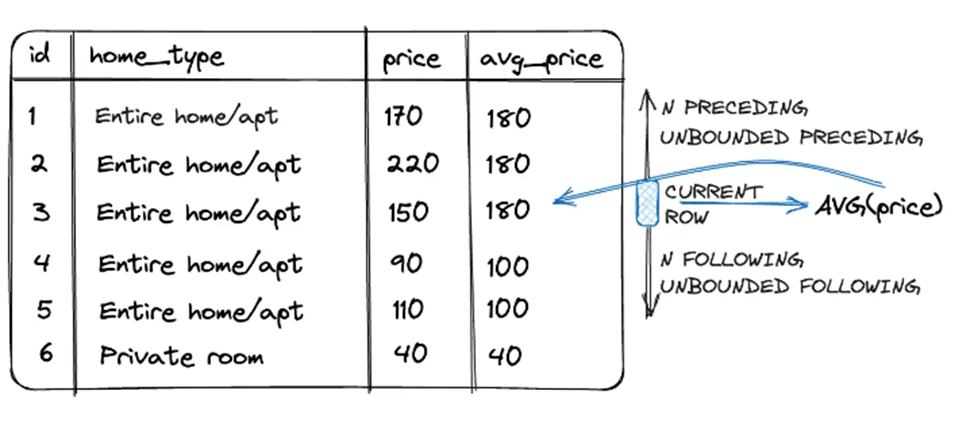

**Отличие ROWS от RANGE**

Для определения границ окна используются ключевые слова ROWS и RANGE. Работают они по-разному:

*ROWS*

•	Основан на физических строках:
При использовании ROWS, определение окна основывается на физическом положении строк относительно текущей строки. Например, 1 PRECEDING означает одну строку до текущей.
•	Точная граница:
Определение окна с помощью ROWS чётко ограничивает количество строк, которые включаются в окно, делая его предсказуемым и конкретным.

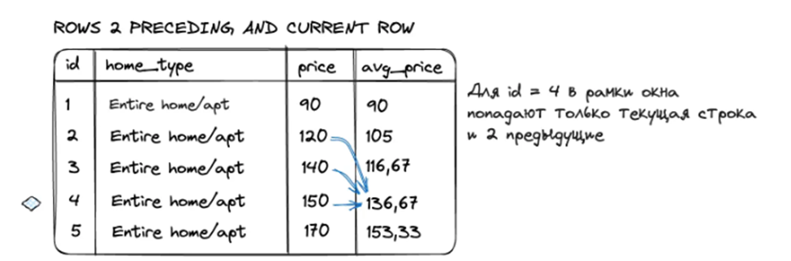

*RANGE*

•	Основан на значениях:
RANGE, в отличие от ROWS, определяет границы окна на основе значений столбцов, упорядоченных в соответствии с ORDER BY в оконной функции.
•	Динамичность границ:
Границы, определённые с помощью RANGE, могут варьироваться в зависимости от данных, что делает окно гибким, но потенциально менее предсказуемым.

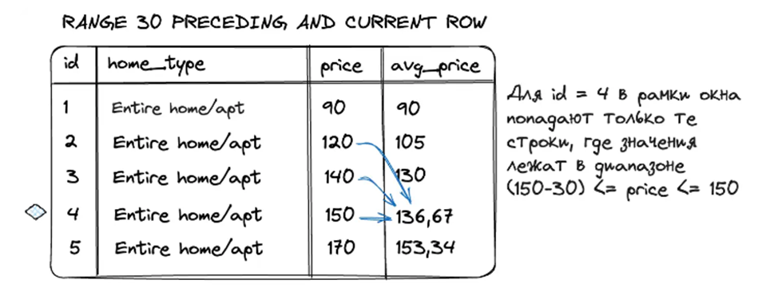

### #3.4 Основные оконные функции

В предыдущих статьях мы рассмотрели как работают оконные функции, познакомились с понятием окна данных, которое передаётся в оконную функцию. Пришло время рассмотреть какие оконные функции бывают.

**Виды оконных функций**

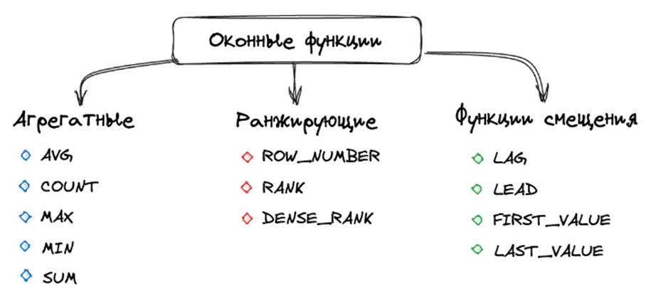    

Оконные функции можно разделить на 3 группы:

•	Агрегатные оконные функции;
•	Ранжирующие оконные функции;
•	Оконные функции смещения.

*Агрегатные оконные функции*

Агрегатные функции — это функции, которые выполняют на наборе данных арифметические вычисления и возвращают итоговое значение.

•	SUM — подсчитывает общую сумму значений;
•	COUNT — считает общее количество записей в колонке;
•	AVG — рассчитывает среднее арифметическое;
•	MAX — находит наибольшее значение;
•	MIN — определяет наименьшее значение.

    SELECT id,
        home_type,
        price,
        SUM(price) OVER(PARTITION BY home_type) AS 'Sum',
        COUNT(price) OVER(PARTITION BY home_type) AS 'Count',
        AVG(price) OVER(PARTITION BY home_type) AS 'Avg',
        MAX(price) OVER(PARTITION BY home_type) AS 'Max',
        MIN(price) OVER(PARTITION BY home_type) AS 'Min'
    FROM Rooms;

| id | home_type | price | Sum | Count | AVG | Max | Min |
| ------------- | ------------- | ------------- | ------------- | ------------- | ------------- | ------------- | ------------- |
| 2 | Entire home/apt | 225 | 3122 | 21 | 148.6667 | 299 | 80 |
| 30 | Entire home/apt | 180 | 3122 | 21 | 148.6667 | 299 | 80 |
| 28 | Entire home/apt | 150 | 3122 | 21 | 148.6667 | 299 | 80 |

*Ранжирующие оконные функции*

Ранжирующие оконные функции — это функции, которые ранжируют значение для каждой строки в окне.
В ранжирующих функциях под ключевым словом OVER обязательным идёт указание условия ORDER BY, по которому будет происходить сортировка ранжирования.
•	ROW_NUMBER — возвращает номер строки, используется для нумерации;
•	RANK — возвращает ранг каждой строки. Вот как это работает:
-	Сортировка: во-первых, строки сортируются по одному или нескольким столбцам. Это столбцы указываются в ORDER BY в конструкции OVER.
-	Присвоение рангов: каждой уникальной строке или группе строк, имеющих одинаковые значения в столбцах сортировки, присваивается ранг. Ранг начинается с 1.
-	Одинаковые значения: если у нескольких строк одинаковые значения в столбцах сортировки, они получают одинаковый ранг. Например, если две строки занимают второе место, обе получают ранг 2.
-	Пропуск рангов: после группы строк с одинаковым рангом, следующий ранг увеличивается на количество строк в этой группе. Например, если две строки имеют ранг 2, следующая строка получит ранг 4, а не 3.
-	Продолжение сортировки: этот процесс продолжается до тех пор, пока не будут присвоены ранги всем строкам в наборе результатов.
•	DENSE_RANK — возвращает ранг каждой строки. Но в отличие от функции RANK, она для одинаковых значений возвращает ранг, не пропуская следующий.

    SELECT id,
        home_type,
        price,
        ROW_NUMBER() OVER(PARTITION BY home_type ORDER BY price) AS 'row_number',
        RANK() OVER(PARTITION BY home_type ORDER BY price) AS 'rank',
        DENSE_RANK() OVER(PARTITION BY home_type ORDER BY price) AS 'dense_rank'
    FROM Rooms;

| id | home_type | price | row_number | rank | dense_rank |
| ------------- | ------------- | ------------- | ------------- | ------------- | ------------- |
| 5 | Entire home/apt | 80 | 1 | 1 | 1 |
| 38 | Entire home/apt | 85 | 2 | 2 | 1 |

*Оконные функции смещения*

Оконные функции смещения — это функции, которые позволяют перемещаться и обращаться к разным строкам в окне, относительно текущей строки, а также обращаться к значениям в начале или в конце окна.

•	LAG — обращается к данным из предыдущих строк окна.
Имеет три аргумента: столбец, значение которого необходимо вернуть, количество строк для смещения (по умолчанию 1), значение, которое необходимо вернуть, если после смещения возвращается значение NULL.
•	LEAD — обращается к данным из следующих строк. Аналогично LAG имеет 3 аргумента.
•	FIRST_VALUE — возвращает первое значение в окне. В качестве аргумента принимает столбец, значение которого необходимо вернуть.
•	LAST_VALUE — возвращает последнее значение в окне. В качестве аргумента принимает столбец, значение которого необходимо вернуть

    SELECT id,
        home_type,
        price,
        LAG(price) OVER(PARTITION BY home_type ORDER BY price) AS 'lag',
        LAG(price, 2) OVER(PARTITION BY home_type ORDER BY price) AS 'lag_2',
        LEAD(price) OVER(PARTITION BY home_type ORDER BY price) AS 'lead',
        FIRST_VALUE(price) OVER(PARTITION BY home_type ORDER BY price) AS 'first_value',
        LAST_VALUE(price) OVER(PARTITION BY home_type ORDER BY price) AS 'last_value'
    FROM Rooms;

| id | home_type | price | lag | lag_2 | lead | first_value | last_value |
| ------------- | ------------- | ------------- | ------------- | ------------- | ------------- | ------------- | ------------- |
| 5 | Entire home/apt | 80 | <NULL> | <NULL> | 85 | 80 | 80 |
| 38 | Entire home/apt | 85 | 80 | <NULL> | 89 | 80 | 85 |
| 4 | Entire home/apt | 89 | 85 | 80 | 99 | 80 | 89 |

## #4 Транзации

Если бы серверы баз данных безотказно работали все 100% времени, если бы пользователи всегда позволяли программам завершать выполнение и если бы приложения всегда завершались без фатальных ошибок, останавливающих выполнение, не было бы ничего, что следовало было бы обсуждать об одновременном доступе к базе данных.

Однако такая идеальная ситуация нереалистична, и поэтому мы должны рассмотреть механизмы, позволяющие множеству пользователей работать с одними и теми же данными. Одним из ключевых элементов в решении этой задачи является транзакция.

Транзакция — это последовательность операций с базой данных, которые выполняются как единое целое.

В данном блоке мы обсудим транзакции, которые позволяют объединять несколько SQL-инструкций в одну группу, гарантируя, что либо все инструкции выполнятся успешно, либо ни одна из них не будет выполнена.

### #4.1 Блокировака в СУБД

Системы управления базами данных обеспечивают возможность одному пользователю извлекать и модифицировать данные. Однако в современном мире тысячи людей могут вносить изменения в базу данных одновременно. Если пользователи в основном осуществляют только чтение данных, то такая нагрузка не представляет особой сложности для сервера базы данных. Но если некоторые пользователи одновременно добавляют и/или изменяют данные, то серверу приходится решать намного более сложные задачи.

Предположим, вы подготавливаете финансовый отчёт, который подводит итоги ежедневных продаж магазина за неделю. В то же время, когда вы работаете над отчётом, происходят следующие операции:
•	Клиент покупает товар
•	Другой клиент возвращает товар, который оказался бракованным, и получает возврат средств
•	Магазин получает новую партию товаров

Таким образом, во время формирования вашего отчёта несколько пользователей изменяют информацию в базе данных. Так какие числа должны появиться в отчёте? 🧐
Ответ зависит от того, как ваш сервер обрабатывает блокировку.

**Блокировка**

Блокировка — это метод ограничения доступа к данным для обеспечения корректной обработки транзакций.

Серверы баз данных используют блокировки, чтобы управлять одновременным доступом к данным, чтобы пока одна транзакция работает с данными, другие транзакции не могли их изменять.

Когда данные в базе блокируются, другие пользователи, которые хотят изменить или прочитать эти же данные, должны подождать, пока блокировка не будет снята.

*Гранулярность блокировок*

Существует ряд различных стратегий, которые могут использоваться, как именно блокировать ресурс. Сервер может применять блокировку на одном из трёх разных уровней, или гранулярностей.
•	Блокировка таблиц
Не позволяет нескольким пользователям одновременно изменять данные в одной таблице.
•	Блокировка страниц
Не позволяет нескольким пользователям изменять данные в одной и той же странице (страница — это сегмент памяти, обычно в диапазоне от 2 до 16 Кбайт) таблицы одновременно.
•	Блокировка строк
Не позволяет нескольким пользователям одновременно изменять одну и ту же строку в таблице.

Эти подходы имеют свои преимущества и недостатки. Блокировка всей таблицы требует небольшого времени, но при увеличении числа пользователей может привести к долгим ожиданиям. Блокировка строк требует большего объёма дополнительных действий, но зато позволяет нескольким пользователям изменять одну и ту же таблицу, если они работают с разными строками.

MySQL может использовать блокировку таблиц, страниц или строк в зависимости от вашего выбора механизма хранения. По умолчанию в MySQL используется механизм хранения InnoDB, который обеспечивает блокировку строк.

### #4.2 Создание транзаций

Если вы попытаетесь перевести 1000 долларов с вашего сберегательного счёта на текущий и вдруг обнаружите, что деньги были списаны, но не зачислены на текущий счёт, вы, скорее всего, расстроитесь. 😿

Для защиты от такого рода ошибок программа, обрабатывающая ваш запрос на перевод денег, сначала начинает транзакцию, затем запускает SQL-запросы, необходимые для перевода денег с одного счёта на другой, и, если все проходит успешно, завершает транзакцию, выполнив команду COMMIT — фиксации изменений.

Однако, если возникнут какие-либо проблемы, будет выполнена команда ROLLBACK, которая указывает серверу отменить все действия, совершённые с начала транзакции.
Процесс может выглядеть следующим образом:

    -- Начало транзакции
    START TRANSACTION;

    -- Проверка наличия достаточного баланса у отправителя
    SELECT @balance := user_balance FROM accounts WHERE user_id = 1;

    -- Если средств недостаточно, отмена транзакции
    IF @balance < 1000 THEN
    ROLLBACK;
    END IF;

    -- Проверка на существование получателя
    SELECT @exists := COUNT(*) FROM accounts WHERE user_id = 2;
    IF @exists = 0 THEN
    ROLLBACK;
    END IF;

    -- Обновление баланса счетов, если все проверки пройдены
    UPDATE accounts SET user_balance = user_balance - 1000 WHERE user_id = 1;
    UPDATE accounts SET user_balance = user_balance + 1000 WHERE user_id = 2;

    -- Применение изменений
    COMMIT;

С помощью транзакции программа обеспечивает сохранность ваших 1000 долларов, гарантируя, что они либо останутся на исходном счёте, либо будут переведены на другой счёт, исключая риск их утраты.

**Запуск и завершение транзакций**

Каждая явная транзакция в MySQL начинается с использования оператора START TRANSACTION.

Завершение же транзакции возможно:
•	с помощью команды COMMIT, которая даёт указание серверу пометить изменения как постоянные и освободить все ресурсы (т.е. блокировки строк), использовавшиеся во время транзакции;
•	с помощью команды ROLLBACK, которая требует от сервера вернуть данные в состояние до начала транзакции. После завершения отката также любые ресурсы, используемые транзакцией, освобождаются.

Помимо использования команд COMMIT и ROLLBACK, транзакция также может завершиться в результате внешних факторов. Например, если сервер выключается, в этом случае ваша транзакция будет автоматически отменена при перезапуске сервера.

**Точки сохранения транзакции**

В определённых ситуациях вам может потребоваться выполнить откат в транзакции, не отменяя всю проделанную работу. Для этого вы можете установить одну или несколько точек сохранения в рамках транзакции. Это позволяет вам откатиться к конкретной точке в транзакции, а не к её началу.

Каждой точке сохранения в рамках одной транзакции необходимо присвоить уникальное имя, что позволит использовать множество разных точек сохранения. Для создания точки сохранения под названием my_savepoint используйте следующую команду:

    SAVEPOINT my_savepoint;

Для отката к определённой точке сохранения просто вводится команда ROLLBACK, за которой следуют ключевые слова TO SAVEPOINT и имя точки сохранения, например:

    START TRANSACTION;

    -- Создаем точку сохранения перед изменением баланса первого пользователя
    SAVEPOINT before_updating_user_1;
    UPDATE accounts SET balance = balance + 100 WHERE user_id = 1;

    -- Проверка условия для первого пользователя
    -- например, проверяем логику бизнес-правил

    -- Здесь мы предполагаем, что условие не выполнилось, и нам нужно отменить изменение баланса
    ROLLBACK TO SAVEPOINT before_updating_user_1;

    -- Обновляем баланс для второго пользователя
    UPDATE accounts SET balance = balance + 200 WHERE user_id = 2;

    -- Завершаем транзакцию
    COMMIT;

В результате этой транзакции баланс первого пользователя останется без изменений из-за отката к точке сохранения, а баланс второго пользователя увеличится на 200. Это показывает, как можно управлять изменениями в базе данных с высоким уровнем контроля при помощи транзакций и точек сохранения.

Когда вы используете точки сохранения, помните следующие моменты:
•	несмотря на название, при создании точки сохранения ничего не сохраняется. Чтобы ваши изменения в рамках транзакции стали постоянными, необходимо выполнить команду COMMIT;
•	при выполнении отката транзакции без указания конкретной точки сохранения, все ранее установленные точки сохранения будут проигнорированы, и будет произведён откат всей транзакции.
