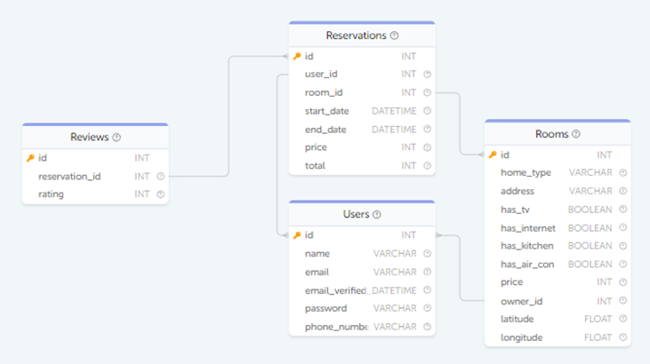
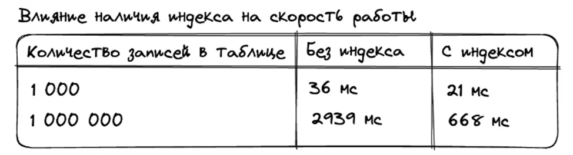

## Базы данных и таблицы

## #1 Создание и удалеие баз данных

При написании SQL запросов мы активно используем таблицы. Сами же таблицы хранятся в рамках конкретных баз данных, о которых и пойдёт речь в данной статье.

**Создание базы данных**

Создание базы данных имеет следующий синтаксис:

    CREATE DATABASE имя_базы_данных;

В качестве имени для базы данных можно использовать сочетания букв, цифр, а также символов "_" и "$". Имя может начинаться с цифр, но не может состоять только из них. Максимальная длина имени составляет 64 знака.

Проконтролировать создание базы данных можно с помощью оператора SHOW DATABASES.

    SHOW DATABASES;
    
| Database |
| ------------- |
| user_table_1 |
| user_table_2 |
| information_schema |
| mysql |
| performance_schema |
| sys |

Обратите внимание, что оператор SHOW DATABASES кроме пользовательских баз данных отображает также и служебные: information_schema, mysql, performance_schema, sys.

**Удаление базы данных**

Удаление базы данных осуществляется с помощью оператора DROP DATABASE

    DROP DATABASE имя_базы_данных;

**Конструкция IF [NOT] EXIST**

При создании базы данных или при её удалении может возникнуть ошибка, что база данных с таким именем уже существует (при создании) или, наоборот, данной базы данных не существует (при удалении). Для таких случаев существует конструкция IF [NOT] EXIST.

То есть, если мы хотим создать базу данных только при условии, что она пока не существует, то используется следующий синтаксис:

    CREATE DATABASE IF NOT EXIST имя_базы_данных;

Если мы хотим удалить базу данных только при условии, что она существует, то используется следующий синтаксис:

    DROP DATABASE IF EXIST имя_базы_данных;

## #2 Создание и удаление таблиц

**Создание таблицы**

Перед созданием таблицы необходимо выбрать базу данных, в которую таблица будет записана. Это делается с помощью оператора USE:

    USE имя_базы_данных;

Для создания таблицы используется оператор CREATE TABLE. Его базовый синтаксис имеет следующий вид:

    CREATE TABLE [IF NOT EXIST] имя_таблицы (
        столбец_1 тип_данных,
        [столбец_2 тип_данных,]
        ...
        [столбец_n тип_данных,]
    );

Например, создадим таблицу пользователей.

    CREATE TABLE Users (
        id INT,
        name VARCHAR(255),
        age INT
    );

INT, VARCHAR(255) - типы данных: числовой и строковый соответственно. Более подробно о них можно будет узнать в следующих статьях.

**Дополнительные параметры определения столбцов**

Вышеприведённое определение столбцов в таблице является упрощённым. Помимо названия столбца и его типа в определение иногда необходимо добавлять следующие необязательные параметры:
•	PRIMARY KEY
Указывает колонку или множество колонок как первичный ключ.
•	AUTO_INCREMENT
Указывает, что значение данной колонки будет автоматически увеличиваться при добавлении новых записей в таблицу. Каждая таблица имеет максимум одну AUTO_INCREMENT колонку. Стоит отметить, что данный параметр можно применять только к целочисленным типам и к типам с плавающей запятой.
•	UNIQUE
Указывает, что значения в данной колонке для всех записей должны быть отличными друг от друга.
•	NOT NULL
Указывает, что значения в данной колонке должны быть отличными от NULL.
•	DEFAULT
Указывает значение по умолчанию. Данный параметр не применяется к типам BLOB, TEXT, GEOMETRY и JSON.

Для нашей таблицы пользователей можно указать следующие параметры:

    CREATE TABLE Users (
        id INT PRIMARY KEY,
        name VARCHAR(255) NOT NULL,
        age INT NOT NULL DEFAULT 18
    );

Так, в данном примере:
•	id - поле числового типа, являющееся первичным ключом;
•	name - поле строкового типа с максимальной длиной в 255 символов, являющееся обязательным к заполнению;
•	age - поле числового типа со значением по умолчанию равным 18.

**Описание таблицы**

Для того, чтобы посмотреть описание созданной таблицы можно воспользоваться оператором DESCRIBE.

    DESCRIBE Users;

| Field	| Type | Null | Key | Default | Extra |
| ------------- | ------------- | ------------- | ------------- | ------------- | ------------- |
| id | int(11) | NO | PRI | <NULL> | - |	
| name | varchar(255) | NO | - | <NULL> | - |	
| age | int(11) | NO | - | 18 | - |

**Дополнительные параметры определения таблицы**

Помимо описания столбцов, при создании таблицы можно дополнительно указать следующие параметры:

•	Первичный ключ.
Если вы не определили первичный ключ с помощью параметров столбца, то это можно сделать с помощью дополнительных параметров таблицы, добавив запись PRIMARY KEY (<столбец_1>, <столбец_n>) после перечисления столбцов:

    CREATE TABLE Users (
        id INT,
        name VARCHAR(255) NOT NULL,
        age INT NOT NULL DEFAULT 18,
        PRIMARY KEY (id)
    );

•	Внешние ключи.
Предположим, что мы хотим хранить данные о компании, в которой работают наши пользователи. Давайте создадим небольшую таблицу Companies, в которой мы будем хранить уникальный идентификатор и название компании:

    CREATE TABLE Companies (
        id INT,
        name VARCHAR(255) NOT NULL,
        PRIMARY KEY (id)
    );

Дальше нужно добавить в таблицу Users поле company – место работы нашего пользователя, которое будет ссылаться на запись в таблице Companies. Полный запрос для создания таблицы будет выглядеть так:

    CREATE TABLE Users (
        id INT,
        name VARCHAR(255) NOT NULL,
        age INT NOT NULL DEFAULT 18,
        company INT,
        PRIMARY KEY (id)
    );

Для того, чтобы при добавлении новых записей в таблицу Users гарантировать, что в колонке company находится идентификатор, существующий в таблице Companies, используется внешний ключ. Он имеет следующий синтаксис:

    FOREIGN KEY (<столбец_1>, <столбец_n>)
    REFERENCES <внешняя_таблица> (<столбец_во_внешней_таблице_1>, <столбец_во_внешней_таблице_n>)
    [ON DELETE действие]
    [ON UPDATE действие]

Полный запрос для создания таблицы с внешним ключом будет таким:

    CREATE TABLE Users (
        id INT,
        name VARCHAR(255) NOT NULL,
        age INT NOT NULL DEFAULT 18,
        company INT,
        PRIMARY KEY (id),
        FOREIGN KEY (company) REFERENCES Companies (id)
    );

При наличии внешних ключей можно определить поведение текущей записи, при изменении или удалении записи, на которую она ссылается.

    CREATE TABLE Users (
        id INT,
        name VARCHAR(255) NOT NULL,
        age INT NOT NULL DEFAULT 18,
        company INT,
        PRIMARY KEY (id),
        FOREIGN KEY (company) REFERENCES Companies (id)
        ON DELETE RESTRICT ON UPDATE CASCADE
    );

ON DELETE RESTRICT означает, что если попробовать удалить компанию, у которой в таблице Users есть данные, база данных не даст этого сделать:

    Cannot delete or update a parent row: a foreign key constraint fails

Если бы было указано ON DELETE CASCADE, то при удалении компании были бы удалены все пользователи, ссылающиеся на эту компанию.
Есть ещё одна опция — ON DELETE SET NULL. При её использовании база данных запишет NULL в качестве значения поля company для всех пользователей, работавших в удалённой компании.
ON UPDATE CASCADE означает, что если компания изменит свой идентификатор, то все пользователи (Users) получат новый идентификатор в поле company.

**Удаление таблицы**

Удаление таблицы производится при помощи оператора DROP TABLE.

    DROP TABLE [IF EXIST] имя_таблицы;

## #3 Типы данных для колонок таблиц

В SQL каждый столбец в таблице должен иметь определённый тип данных, указывающий на то, какая информация может храниться в этом столбце. Тип данных столбца определяет, какие операции можно выполнять с данными в этом столбце, сколько места требуется для хранения данных и как данные хранятся внутри.

В SQL есть несколько распространённых типов данных, в том числе:
•	Строковый тип данных
•	Числовой тип данных
•	Булевый тип данных
•	Дата и время

При определении таблицы в SQL важно выбрать соответствующие типы данных для каждого столбца, чтобы обеспечить эффективное хранение и извлечение данных. Кроме того, важно учитывать возможный диапазон значений, которые будут храниться в каждом столбце, и выбирать тип данных, соответствующий этому диапазону.

В следующих статьях мы детально познакомимся с каждым типом.

### #3.1 Строковый тип данных

Строковый тип данных является наиболее используемым типом данных. Благодаря ему в базе данных хранятся как текстовые, так и различные двоичные данные (например, картинки).

В MySQL он представлен следующими типами:

**CHAR и VARCHAR**

| Тип | Описание | Диапазон символов |
| ------------- | ------------- | ------------- |
| CHAR(X) | Содержит текстовые строки. Длина фиксируемая, её вы указываете при объявлении. В случае, если длина строки меньше указанной, она дополняется правыми пробелами до указанной длины. | Длина может быть любой в диапазоне от 0 до 255 |
| VARCHAR(X) | Содержит текстовые строки. Длина строк динамическая. | Длина может быть любой в диапазоне от 0 до 65,535 |	

**BINARY и VARBINARY**

Типы данных BINARY и VARBINARY аналогичны VARCHAR и CHAR только они хранят двоичные строки.

| Тип | Описание | Диапазон символов |
| ------------- | ------------- | ------------- |
| BINARY(X) | Содержит двоичные строки. Длина фиксируемая, её вы указываете при объявлении. | Длина может быть любой в диапазоне от 0 до 255 |
| VARBINARY(X) | Содержит двоичные строки. Длина строк динамическая. | Длина может быть любой в диапазоне от 0 до 65,535 |

**BLOB и TEXT**

BLOB используется для хранения больших бинарных данных, таких как картинки. TEXT предназначен также для хранения больших данных, но текстового содержания.
Разница между ними заключается в том, что сортировки и сравнения сохранённых данных у BLOB чувствительны к регистру и не чувствительны к регистру в полях TEXT.

| Тип | Описание | Диапазон символов |
| ------------- | ------------- | ------------- |
| BLOB | Содержит двоичные строки. | Максимальная длина 66.535 |
| TEXT | Содержит текстовые строки. | Максимальная длина 66.535 |

BLOB и TEXT имеют дополнительные подтипы, которые отличаются максимальным размером данных, которые можно в них хранить.

| Тип | Диапазон символов |
| ------------- | ------------- |
| TINYBLOB | Максимальная длина 255 |
| MEDIUMBLOB | Максимальная длина 16,777,215 |
| LONGBLOB | Максимальная длина 4,294,967,295 |
| TETINYTEXT | Максимальная длина 255 |
| MEDIUMTEXT | Максимальная длина 16,777,215 |
| LONGTEXT | Максимальная длина 4,294,967,295 |

### #3.2 Числовой тип данных

Числовые данные разделяются на точные и приближенные, на целые и вещественные. В отдельную категорию можно отнести битовые значения.

**Точные целые числа**

| Тип | Объем памяти | Диапазон |
| ------------- | ------------- | ------------- |
| TINYINT | 1 байт | от -128 до 127 (от -27 до 27-1) от 0 до 255 (от 0 до 28-1) |
| SMALLINT | 2 байта | от -32768 до 32767 (от -215 до 215-1) от 0 до 65535 (от 0 до 216-1) |
| MEDIUMINT | 3 байта | от -223 до 223-1 от 0 до 224-1 |
| INT INTEGER (синонимы) | 4 байта | от -231 до 231-1 от 0 до 232-1 |
| BIGINT | 8 байт | от -263 до 263-1 от 0 до 264-1 |

Целые числа могут быть объявлены с ключевым словом UNSIGNED. В этом случае элементам данного столбца нельзя будет присвоить отрицательные значения, а допустимый диапазон, которые принимает тип удваивается. 
Так, тип TINYINT может принимать значения от -128 до 127, а TINYINT UNSIGNED — от 0 до 255.

**Точные вещественные числа**

| Тип | Диапазон |
| ------------- | ------------- |
| DEC[(M,D)] DECIMAL[(M,D)] (синонимы) | Зависит от параметров M и D |

Тип DECIMAL хранит точное вещественное значение данных. Он используется, когда точность является критически важной. Например, при хранении финансовых данных.

Пример использования:

    CREATE TABLE Users (
        ...
        salary DECIMAL(5,2)
    );

В данном примере объявляется, что в колонке salary будут храниться числа, имеющие максимум 5 цифр, причём 2 из которых отведены под десятичную часть. То есть, в данной колонке будут храниться значения в промежутке от -999.99 до 999.99.
Синтаксис DECIMAL эквивалентен DECIMAL(M) и DECIMAL(M,0). По умолчанию, параметр M равен 10.
Целая часть и часть после точки хранятся как 2 отдельных целых числа. На основании этого факта можно легко рассчитать затрачиваемый объем памяти. Так у DECIMAL(5,2) целая часть содержит 3 цифры и занимает 2 байта, часть после точки 2 цифры - достаточно 1 байта. Итого, на хранение будет потрачено 3 байта.

**Битовые числа**

| Тип | Объем памяти | Диапазон |
| ------------- | ------------- | ------------- |
| BIT[(M)] | M бит | От 1 до 64 битов, в зависимости от значения M |
| BOOL BOOLEAN (синонимы) | 1 байт | Либо 0, либо 1 |

Тип данных BIT(M) хранит последовательность битов заданной длины. По умолчанию, длина составляет 8 бит. Если назначаемое значение в колонке с данным типом использует меньше M бит, то происходит дополнение нулями слева. Например, при попытке записать значение b'101' в BIT(6) храниться в итоге будет b'000101'.

**Приближенные числа**

| Тип | Объем памяти | Диапазон |
| ------------- | ------------- | ------------- |
| FLOAT[(M, D)] | 4 байта | Минимальное значение ±1.17·10-39 Максимальное значение ±3.4·1038 |
| REAL[(M, D)] DOUBLE[(M, D)] (синонимы) | 8 байтов | Минимальное значение ±2.22·10-308 Максимальное значение ±1.79·10308 |

Числовые типы данных с плавающей точкой также могут иметь параметр UNSIGNED. Как и в целочисленных типах, этот атрибут предотвращает хранение в отмеченном столбце отрицательных величин, но, в отличие от целочисленных типов, максимальный интервал для величин столбца остаётся прежним.

### #3.3 Работа с датами и временем

Для работы с датой и временем в MySQL есть несколько типов данных: DATE, TIME, DATETIME и TIMESTAMP.

| Тип | Описание | Диапазон значений | Размер |
| ------------- | ------------- | ------------- | ------------- |
| DATE | Хранит значения даты в виде ГГГГ-ММ-ДД. Например, 2022-12-05 | от 1000-01-01 до 9999-12-31 | 3 байта |
| TIME | Хранит значения времени в формате ЧЧ:ММ:СС. (или в формате ЧЧЧ:ММ:СС для значений с большим количеством часов). Например, 800:50:50 | от -838:59:59 до 838:59:59 | 3 байта |
| DATETIME | Хранит значение даты и времени в виде ГГГГ-MM-ДД ЧЧ:ММ:СС. Например, 2022-12-05 10:37:22 | от 1000-01-01 00:00:00 до 9999-12-31 23:59:59 | 8 байта |
| TIMESTAMP | Хранит значение даты и времени в виде ГГГГ-MM-ДД ЧЧ:ММ:СС. Например, 2022-12-05 10:37:22 | от 1970-01-01 00:00:01 до 2038-01-19 03:14:07 | 4 байта |

**Отличие TIMESTAMP и DATETIME**

Типы данных DATETIME и TIMESTAMP в MySQL похожи друг на друга, так как оба направлены на хранение даты и времени. Но между ними есть ряд существенных отличий, определяющих какой из этих типов данных когда лучше использовать.

**DATETIME**

Хранит значения в диапазоне от 1000-01-01 00:00:00 до 9999-12-31 23:59:59 и при этом занимает 8 байт. Этот тип данных не зависит от временной зоны, установленной в MySQL. Он всегда отображается ровно в таком виде, в котором был установлен и в котором хранится в базе данных. То есть при изменении часового пояса, отображение времени не изменится.

    CREATE TABLE datetime_table (datetime_field DATETIME);
        SET @@session.time_zone="+00:00"; -- сбрасываем часовой пояс в MYSQL
        INSERT INTO datetime_table VALUES("2022-06-16 16:37:23");
        SET @@session.time_zone="+03:00"; -- меняем часовой пояс в MYSQL
    SELECT * FROM datetime_table;

| datetime_field |
| ------------- |
| 2022-06-16 16:37:23 |

**TIMESTAMP**

Хранит сколько прошло секунд с 1970-01-01 00:00:00 по нулевому часовому поясу и занимает 4 байта. При выборках отображается с учётом текущего часового пояса. Часовой пояс можно задать в настройках операционной системы, где работает MySQL, в глобальных настройках MySQL или в конкретной сессии. В базе данных при создании записи с типом TIMESTAMP значение сохраняется по нулевому часовому поясу.

    CREATE TABLE timestamp_table (timestamp_field TIMESTAMP);
        SET @@session.time_zone="+00:00"; -- сбрасываем часовой пояс в MYSQL
        INSERT INTO timestamp_table VALUES("2022-06-16 16:37:23");
        SET @@session.time_zone="+03:00"; -- меняем часовой пояс в MYSQL
    SELECT * FROM timestamp_table;

| timestamp_field |
| ------------- |
| 2022-06-16 19:37:23 |

Также стоит помнить о существующем ограничении TIMESTAMP в диапазоне возможных значений от 1970-01-01 00:00:01 до 2038-01-19 03:14:07, что ограничивает его применение. Так, данный тип данных не подойдёт для хранения дат рождения пользователей.

***Способ задания значений***

Значения DATETIME, DATE и TIMESTAMP могут быть заданы одним из следующих способов:
•	Как строка в формате YYYY-MM-DD HH:MM:SS или в формате YY-MM-DD HH:MM:SS для указания даты и времени;
•	Как строка в формате YYYY-MM-DD или в формате YY-MM-DD для указания только даты.

При указании даты допускается использовать любой знак пунктуации в качестве разделительного между частями разделов даты или времени. Также возможно задавать дату вообще без разделительного знака, слитно.

    CREATE TABLE date_table (datetime TIMESTAMP);
        INSERT INTO date_table VALUES("2022-06-16 16:37:23");
        INSERT INTO date_table VALUES("22.05.31 8+15+04");
        INSERT INTO date_table VALUES("2014/02/22 16*37*22");
        INSERT INTO date_table VALUES("20220616163723");
        INSERT INTO date_table VALUES("2021-02-12");
    SELECT * FROM date_table;

| datetime |
| ------------- |
| 2022-06-16 16:37:23 |
| 2022-05-31 08:15:04 |
| 2014-02-22 16:37:22 |
| 2022-06-16 16:37:23 |
| 2021-02-12 00:00:00 |

## #4 Представления, VIEW

Хорошо спроектированные приложения обычно предоставляют открытый интерфейс, скрывая детали реализации, что позволяет вносить изменения в дизайн без влияния на конечных пользователей.

При разработке вашей базы данных вы можете достичь аналогичного результата, закрывая таблицы и предоставляя доступ к данным только через набор представлений.

**Что такое представление**

Представление — объект базы данных, являющийся результатом выполнения запроса к базе данных, определённого с помощью оператора SELECT, в момент обращения к представлению.

Представления иногда называют «виртуальными таблицами». Это связано с тем, что представление для пользователя выглядит как таблица, но фактически не хранит данных, а извлекает их из других таблиц в момент обращения.

Если данные в основной таблице меняются, пользователь получает актуальные данные при обращении к представлению, использующему эту таблицу. При этом представления не кэшируют результаты выборки из таблицы в процессе работы.

**Пример создания представления**

В качестве простого примера предположим, что вы хотите частично скрыть адреса электронной почты в таблице пользователей (Users).

Это может быть полезно, например, если политика вашей компании не позволяет всем использовать конфиденциальную информацию об пользователях. Поэтому вместо того, чтобы разрешить прямой доступ к таблице пользователей (Users), 
вы определяете представление с именем ViewUsers и требуете, чтобы все использовали его для доступа к данным о пользователях.

Пример определения представления:

    CREATE VIEW ViewUsers AS
        SELECT id,
            name,
            CONCAT(SUBSTR(email, 1, 2), '****', SUBSTR(email, -4)) AS email
    FROM Users;

Представление в SQL-запросе выглядит и используется как обычная таблица:

    SELECT * FROM ViewUsers;

| id | name | Email |
| ------------- | ------------- | ------------- |
| 1 | Bruce Willis | ba****.com |
| 2 | George Clooney | te****.com |
| 3 | Kevin Costner | me****.com |

Если вы хотите узнать, какие столбцы доступны в представлении, вы можете использовать оператор DESCRIBE:

    DESCRIBE ViewUsers;

| Field | Type | Null | Key | Default | Extra |
| ------------- | ------------- | ------------- | ------------- | ------------- | ------------- |
| id | int | NO | - | <NULL> | - |
| name | varchanr(32) | NO | - | <NULL> | - |
| email | varchar(38) | YES | - | <NULL> | - |

**Общий синтаксис представления**

    CREATE [OR REPLACE]
    VIEW имя_представления [(имена_полей_представления)]
    AS select_выражение

OR REPLACE — при использовании этого опционального параметра в случае, если представление с таким именем уже существует, старое представление будет удалено, а новое создано. В противном случае, при попытке создать представление с существующим именем, возникнет ошибка.

**Зачем нужны представления**

*Упрощение сложных запросов*

Представления используются для упрощения сложных запросов и создания абстракции между пользователем и базой данных. Они могут скрывать сложность структуры данных и предоставлять упрощённый интерфейс для доступа к данным.

*Улучшение производительности*

Создание представлений, которые инкапсулируют сложные запросы, может помочь оптимизировать выполнение этих запросов. Это может привести к более быстрому выполнению запросов и улучшению общей производительности базы данных.

*Обеспечение безопасности*

Представления могут использоваться для обеспечения безопасности конфиденциальных данных. Создание представлений, которые ограничивают доступ к определённым столбцам или строкам данных, позволяет администраторам ограничить доступ к чувствительной информации. Это помогает гарантировать, что только авторизованные пользователи имеют доступ к конфиденциальным данным.

**Итоги**

Представления являются важным инструментом в SQL, который позволяет упростить сложные запросы, стандартизировать доступ к данным, повысить производительность и обеспечить безопасность данных.

## #4 Индексы в SQL

Когда вы добавляете в таблицу новую строку, СУБД размещает эти данные не оптимально. Например, если вы добавляете строку в таблицу Users, СУБД не размещает строки в числовом порядке значений столбца id или в алфавитном порядке значений столбца last_name. Вместо этого он просто помещает данные в следующее доступное место в файле (СУБД поддерживает список свободных мест для каждой таблицы).

Это приводит к тому, что для выполнения запроса типа:

    SELECT email FROM Users WHERE email LIKE 'l%';

Серверу базы данных приходится проверять каждую строку таблицы, чтобы найти соответствия. Это подходит для маленьких таблиц, но становится чрезмерно времязатратным по мере роста объёма данных.

Для сравнения как запрос на поиск по email отработает в зависимости от наличия индекса на поле.

Индексы функционируют как предметные указатели в книге 📖, позволяя быстро находить информацию без прочтения всего текста. Они представляют собой специальные таблицы, строки которых, в отличие от обычных таблиц данных, расположены в строго определённом порядке. Но вместо того, чтобы содержать все данные о некоторой записи, индекс содержит только столбец (или столбцы), используемый, чтобы найти строки в таблице данных, вместе с информацией, описывающей, где физически расположена эта строка. Таким образом, роль индексов состоит в том, чтобы облегчить поиск подмножества строк и столбцов таблицы без необходимости сканировать каждую строку в таблице.

**Создание индекса**

Возвращаясь к таблице Users, вы можете добавить индекс к столбцу email, чтобы ускорить любые запросы, которые работают со значением этого столбца.

Вот как можно добавить такой индекс в СУБД MySQL:

    CREATE INDEX idx_emai
        ON Users (email);

Эта инструкция создаёт индекс c именем idx_email для столбца Users.email. При наличии индекса оптимизатор запросов может выбрать использование индекса, если сочтёт это полезным. Если в таблице имеется более одного индекса, оптимизатор должен решить, применение какого именно индекса наиболее выгодно для конкретной инструкции SQL.

Все системы управления базами данных предоставляют возможность просмотра существующих индексов. Для пользователей MySQL существует команда SHOW, которая позволяет отобразить все индексы для конкретной таблицы, как показано в примере ниже:

    SHOW INDEX FROM Users;

| Table | Non_unique | Key_name | Seq_in_index | Column_name |
| ------------- | ------------- | ------------- | ------------- | ------------- |
| users | 0 | PRIMARY | 1 | id |
| users | 1 | idx_email | 1 | email |

Вывод демонстрирует, что в таблице Users есть 2 индекса: один — для столбца id с именем PRIMARY и ещё один для столбца email, который мы только что определили.
Когда таблица была создана, MySQL автоматически сгенерировала индекс для столбца первичного ключа, которым в данном случае является id, и присвоил индексу имя PRIMARY. Это особый тип индекса, используемый с ограничением первичного ключа, которое гарантирует, что каждое значение в столбце или группе столбцов, назначенных в качестве первичного ключа таблицы, уникально и не может быть NULL.

**Удаление индекса**

Если после создания индекса вы решите, что он больше не нужен, можете удалить его следующим образом:

    DROP INDEX idx_email ON Users;

**Уникальные (UNIQUE) индексы**

При проектировании баз данных важно определить, для каких столбцов допускаются повторения значений, а для каких — нет

Например, в таблице Users может быть несколько пользователей с одинаковыми именами, но идентификаторы и адреса электронных почт они должны иметь разные, чтобы была возможность их различать.
Добиться гарантируемой уникальности значений можно, создав уникальный индекс на столбец Users.email. Уникальный индекс выполняет две функции:
-	он обеспечивает все преимущества стандартного индекса;
-	он предотвращает дублирование значений в индексируемом столбце.

Система управления базой данных будет проверять уникальный индекс при попытке добавления или изменения данных в индексированном столбце, чтобы убедиться, что введённое значение не дублирует уже существующее в таблице.

Создание уникального индекса для столбца Users.email выполняется следующим образом:

    CREATE UNIQUE INDEX idx_email
        ON Users (email);

При наличии индекса вы получите сообщение об ошибке, если попытаетесь добавить нового клиента с уже существующим адресом электронной почты:

    Error(1062) 23000: "Duplicate entry 'duplicate@gmail.com' for key 'users.idx_email'"

Создание уникальных индексов для столбца или столбцов, определённых как первичный ключ, излишне, так как система управления базой данных автоматически обеспечивает уникальность значений первичного ключа. Впрочем, размещение нескольких уникальных индексов в одной таблице допустимо и может быть целесообразно, если вы видите в этом необходимость.

**Многостолбцовые индексы**

Помимо одностолбцовых индексов, существует возможность создавать индексы, включающие в себя несколько столбцов. К примеру, для поиска студентов по имени и фамилии можно создать совместный индекс по этим двум полям:

    CREATE INDEX idx_full_name
        ON Student (last_name, first_name);

Такой индекс окажется полезным для запросов, где необходимы и имя, и фамилия, или только фамилия. Однако, для запросов, задающих только имя, он не принесёт пользы. Это аналогично поиску номера телефона по телефонному справочнику: если известны и имя, и фамилия, поиск упрощается благодаря упорядоченности справочника по фамилии, а затем по имени. Если же известно только имя, придётся перебирать все записи в поисках нужного человека.

При создании индексов, включающих несколько столбцов, важно продумать порядок столбцов в индексе, чтобы он был максимально эффективным. Однако для достижения нужной производительности запросов всегда можно создать несколько индексов с теми же столбцами, но разным порядком их следования.
Как используются индексы

Индексы часто применяются СУБД для эффективного поиска нужных строк в таблице, а затем для получения дополнительных данных из связанных таблиц по запросу пользователя. Возьмём для примера запрос:

    SELECT id, first_name, last_name
    FROM Student
    WHERE first_name LIKE 'A%' AND last_name LIKE 'L%'

В ответ на такой запрос СУБД может выбрать один из нескольких подходов:
-	Произвести полное сканирование всех строк таблицы;
-	Воспользоваться индексом по столбцу last_name для поиска студентов с фамилией на «L», а затем проверить каждую из этих строк на соответствие имени, начинающегося на «A»;
-	Использовать составной индекс по last_name и first_name для непосредственного нахождения студентов, удовлетворяющих обоим критериям.

Последний метод представляется наиболее эффективным, так как позволяет найти все необходимые строки за один проход, избегая повторного обращения к таблице. Но как определить, какой из методов выберет оптимизатор запросов MySQL? Для этого можно использовать команду EXPLAIN, которая показывает, как СУБД планирует выполнить запрос, не запуская его фактически:

    EXPLAIN
        SELECT id, first_name, last_name
        FROM Student
        WHERE first_name LIKE 'A%'
        AND last_name LIKE 'L%';

| id | select_type	table | partitions | possible_keys | key |
| ------------- | ------------- | ------------- | ------------- | ------------- |
| 1 | SIMPLE | Student | <NULL> | idx_full_name,idx_last_name | idx_full_name |

Анализируя результаты, можно увидеть, что в столбце possible_keys указаны потенциально применимые индексы idx_last_name или idx_full_name, а в столбце key указано, что выбран индекс idx_full_name.

**Обратная сторона индексов**

Если индексы столь эффективны, возникает вопрос: почему бы просто не индексировать всё подряд? 🧐

Ответ кроется в том, что каждый индекс представляет собой таблицу (пусть и особый тип таблицы, но все же это таблица). Следовательно, каждый раз, когда строка добавляется в таблицу или удаляется из неё, должны быть изменены все индексы в этой таблице. При обновлении строки любые индексы для столбца (или столбцов), которые были затронуты, также должны быть изменены. Следовательно, чем больше у вас индексов, тем больше должна работать СУБД, чтобы поддерживать все объекты схемы в актуальном состоянии — что приводит к замедлению работы.

Более того, индексы занимают дополнительное место на диске и требуют внимательного управления со стороны администраторов баз данных. Поэтому оптимальным решением является создание индексов только тогда, когда это действительно необходимо. Если индекс нужен временно, например, для выполнения месячного отчёта, его можно добавить перед началом процедуры и удалить после её завершения.

В итоге, идеальный подход заключается в нахождении баланса: необходимо иметь достаточно индексов для эффективной работы, но не столько, чтобы это сказывалось на производительности. Если вы не уверены в нужном количестве индексов, начните с минимального их числа и добавляйте по мере необходимости.

